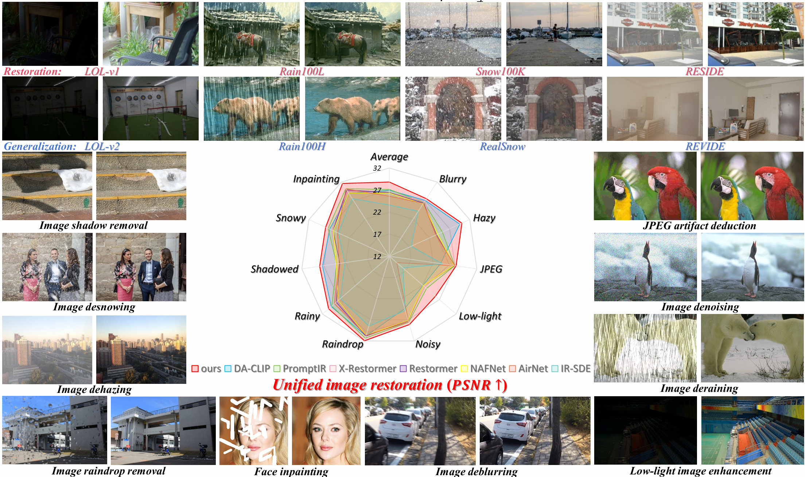

# Elucidating and Endowing the Diffusion Training Paradigm for Image Restoration

<a href='https://arxiv.org/abs/2506.21722'></a> &nbsp;&nbsp;

This is the official PyTorch implementation of the paper:

>**Elucidating and Endowing the Diffusion Training Paradigm for Image Restoration**<br>
>Xin Lu, Jie Huang, Jie Xiao, Zihao Fan, Ziang Zhou, Xueyang Fu<sup>&dagger;</sup>, Zheng-Jun Zha<br>
>University of Science and Technology of China (USTC)<br>




## :wrench: Dependencies and Installation

```bash
git clone https://github.com/xin1u/EEDTP.git
cd EEDTP
pip install -r requirements.txt
```

**Main dependencies:** PyTorch >= 1.10, torchvision, numpy, Pillow, timm, tensorboard, lpips


## :file_folder: Project Structure

```
EEDTP/
├── networks/
│   ├── eedtp_arch.py           # EEDTP conditional restoration network (NAFNet + IRSDE)
│   ├── diffusion_reg.py        # IRSDE + L_reg + L_orthog + weight decay
│   ├── moe_adapter.py          # MoE adapters with time-based prompts
│   ├── image_utils.py          # split-merge utilities
│   └── local_arch.py           # local architecture
├── datasets/datasets_pairs.py
├── loss/
│   ├── losses.py
│   └── pytorch_colors.py
├── utils/UTILS.py, UTILS1.py
├── train_pretrain.py            # Timestep Matched Diffusion Denoising Pre-training (TMDDP)
├── train_eedtp.py               # Generalization Enhanced Fine-tuning (GEF)
├── train_unified.py             # Multi-task Unified Learning (MTUL)
├── TEST.py                      # Inference with ensemble + split-merge
├── README.md
├── .gitignore
└── requirements.txt
```


## :rocket: Quick Start

### 1. Diffusion Denoising Pre-training (TMDDP)

Pre-train on GT images with diffusion denoising objective:

```bash
python train_pretrain.py \
    --gt_dir ./data/gt_images/ \
    --save_path ./ckpt/ \
    --diffusion_T 50 \
    --total_iters 100000 \
    --batch_size 16 \
    --lr 5e-5
```

### 2. Single-task Generalization Enhanced Fine-tuning (GEF)

Fine-tune on degradation-specific paired data with diffusion regularization:

```bash
python train_eedtp.py \
    --task dehazing \
    --load_pre_model True \
    --pre_model ./ckpt/pretrained_model.pth \
    --training_in_path ./data/dehazing/train_input/ \
    --training_gt_path ./data/dehazing/train_gt/ \
    --eval_in_path ./data/dehazing/val_input/ \
    --eval_gt_path ./data/dehazing/val_gt/ \
    --total_iters 500000 \
    --lambda_reg 0.2 \
    --gen_prob 0.1
```

### 3. Multi-task Unified Learning (MTUL)

Incremental training with MoE adapters:

```bash
python train_unified.py \
    --pre_model ./ckpt/pretrained_model.pth \
    --data_root ./data/ \
    --tasks noisy,rainy,jpeg,snowy,inpainting,raindrop,shadowed,lowlight,hazy,blurry \
    --iters_per_task 100000 \
    --num_experts 10
```

### 4. Inference

```bash
# single-task
python TEST.py \
    --model_path ./ckpt/best_model.pth \
    --input_path ./data/test_input/ \
    --gt_path ./data/test_gt/ \
    --output_path ./results/ \
    --task dehazing \
    --use_ensemble True

# multi-task
python TEST.py \
    --model_path ./ckpt/unified_model.pth \
    --input_path ./data/test_input/ \
    --gt_path ./data/test_gt/ \
    --task rainy
```


## :page_facing_up: Citation

If you find this work useful, please cite:

```bibtex
@article{lu2025eedtp,
  title={Elucidating and Endowing the Diffusion Training Paradigm for Image Restoration},
  author={Lu, Xin and Huang, Jie and Xiao, Jie and Fan, Zihao and Zhou, Ziang and Fu, Xueyang and Yin, Baocai},
  journal={arXiv preprint arXiv:2506.21722},
  year={2025}
}
```


## :e-mail: Contact

If you have any questions, please feel free to contact us via email: `xin1u@mail.ustc.edu.cn`
